[Advent of code](https://adventofcode.com/)


Run `python utils/create_file.py` to create a file for the next exercise.

Uses [advent-of-code-data](https://github.com/wimglenn/advent-of-code-data) to get the inputs and submit results.
It needs to know your session ID (see [here](https://github.com/wimglenn/advent-of-code-wim/issues/1) how to get it). 
I'm using [python-dotenv] to read them from `\.env`, which looks like this:
```sh
AOC_SESSION=your_session_id
```
Altenatively, just permanently set the env variable or store the session id in `Path.home() / ".config/aocd/token"`.

# Summary
Generated by [aoc_tiles](https://github.com/LiquidFun/aoc_tiles):

<!-- AOC TILES BEGIN -->
<h1 align="center">
  Advent of Code - 173/492 ⭐
</h1>
<h1 align="center">
  2024 - 42 ⭐ - Python
</h1>
<a href="2024/01.py">
  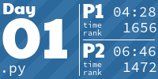
</a>
<a href="2024/02.py">
  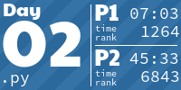
</a>
<a href="2024/03.py">
  
</a>
<a href="2024/04.py">
  
</a>
<a href="2024/05.py">
  
</a>
<a href="2024/06.py">
  
</a>
<a href="2024/07.py">
  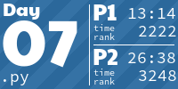
</a>
<a href="2024/08.py">
  
</a>
<a href="2024/09.py">
  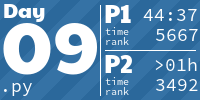
</a>
<a href="2024/10.py">
  
</a>
<a href="2024/11.py">
  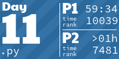
</a>
<a href="2024/12.py">
  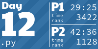
</a>
<a href="2024/13.py">
  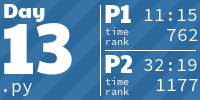
</a>
<a href="2024/14.py">
  
</a>
<a href="2024/15.py">
  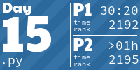
</a>
<a href="2024/16.py">
  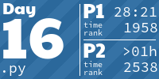
</a>
<a href="2024/17.py">
  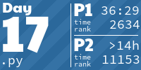
</a>
<a href="2024/18.py">
  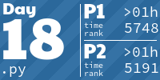
</a>
<a href="2024/19.py">
  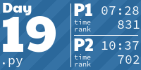
</a>
<a href="2024/20.py">
  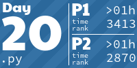
</a>
<a href="2024/21.py">
  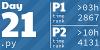
</a>
<h1 align="center">
  2023 - 50 ⭐ - Python
</h1>
<a href="2023/01.py">
  
</a>
<a href="2023/02.py">
  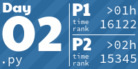
</a>
<a href="2023/03.py">
  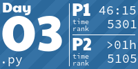
</a>
<a href="2023/04.py">
  
</a>
<a href="2023/05.py">
  
</a>
<a href="2023/06.py">
  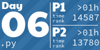
</a>
<a href="2023/07a.py">
  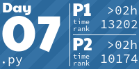
</a>
<a href="2023/08.py">
  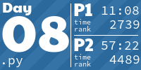
</a>
<a href="2023/09.py">
  
</a>
<a href="2023/10.py">
  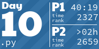
</a>
<a href="2023/11.py">
  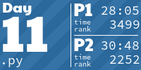
</a>
<a href="2023/12.py">
  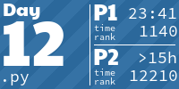
</a>
<a href="2023/13.py">
  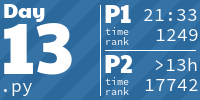
</a>
<a href="2023/14.py">
  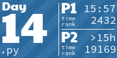
</a>
<a href="2023/15.py">
  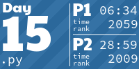
</a>
<a href="2023/16.py">
  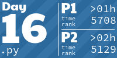
</a>
<a href="2023/17.py">
  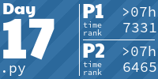
</a>
<a href="2023/18.py">
  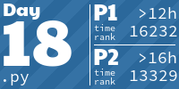
</a>
<a href="2023/19.py">
  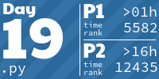
</a>
<a href="2023/20.py">
  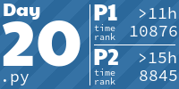
</a>
<a href="2023/21.py">
  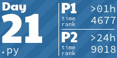
</a>
<a href="2023/22.py">
  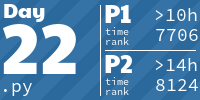
</a>
<a href="2023/23a.py">
  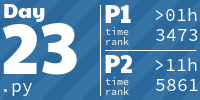
</a>
<a href="2023/24.py">
  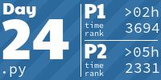
</a>
<a href="2023/25.py">
  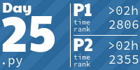
</a>
<h1 align="center">
  2022 - 18 ⭐ - Python
</h1>
<a href="2022/1/solution.py">
  
</a>
<a href="2022/2/solution.py">
  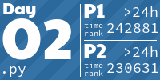
</a>
<a href="2022/3/solution.py">
  
</a>
<a href="2022/4/solution.py">
  
</a>
<a href="2022/5/solution.py">
  
</a>
<a href="2022/6/solution.py">
  
</a>
<a href="2022/7/solution.py">
  
</a>
<a href="2022/8/solution.py">
  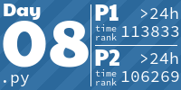
</a>
<a href="2022/09.py">
  
</a>
<h1 align="center">
  2021 - 8 ⭐ - Python
</h1>
<a href="2021/01.py">
  
</a>
<a href="2021/02.py">
  
</a>
<a href="2021/03.py">
  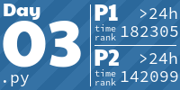
</a>
<a href="2021/04.py">
  
</a>
<h1 align="center">
  2019 - 10 ⭐ - Python
</h1>
<a href="2019/01.py">
  
</a>
<a href="2019/02.py">
  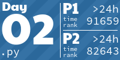
</a>
<a href="None">
  
</a>
<a href="None">
  
</a>
<a href="2019/05.py">
  
</a>
<a href="None">
  
</a>
<a href="2019/07.py">
  
</a>
<a href="None">
  
</a>
<a href="2019/09.py">
  
</a>
<h1 align="center">
  2018 - 45 ⭐ - 
</h1>
<a href="2018/01.ipynb">
  
</a>
<a href="2018/02.ipynb">
  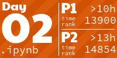
</a>
<a href="2018/03.ipynb">
  
</a>
<a href="2018/04.ipynb">
  
</a>
<a href="2018/05.ipynb">
  
</a>
<a href="2018/06.ipynb">
  
</a>
<a href="2018/07.ipynb">
  
</a>
<a href="2018/08.ipynb">
  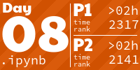
</a>
<a href="2018/09.ipynb">
  
</a>
<a href="2018/10.ipynb">
  
</a>
<a href="2018/11.ipynb">
  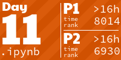
</a>
<a href="2018/12.ipynb">
  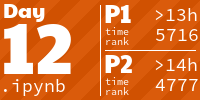
</a>
<a href="2018/13.py">
  
</a>
<a href="2018/14.ipynb">
  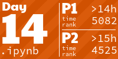
</a>
<a href="2018/15.py">
  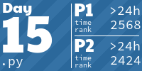
</a>
<a href="2018/16.py">
  
</a>
<a href="2018/17.ipynb">
  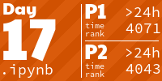
</a>
<a href="2018/18.py">
  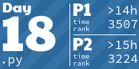
</a>
<a href="2018/19.py">
  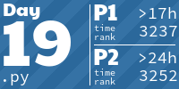
</a>
<a href="None">
  
</a>
<a href="2018/21.ipynb">
  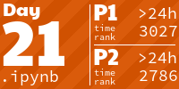
</a>
<a href="2018/22.ipynb">
  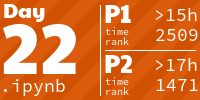
</a>
<a href="2018/23.ipynb">
  
</a>
<a href="None">
  
</a>
<a href="2018/25.ipynb">
  
</a>
<!-- AOC TILES END -->

To run manually use 
`pre-commit run --hook-stage post-commit aoc-tiles` or
`uvx aoc-tiles`.